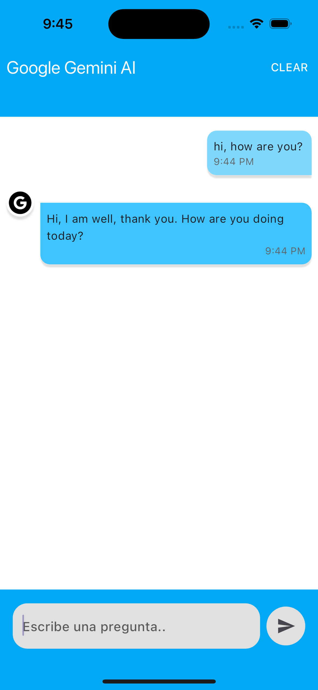

# Application with Gemini AI

Flutter application with Google Gemini AI and others integrations.


## Environment Variables

To run this project, you will need to add the following environment variables to your .env file.

`GEMINI_KEY`

## Installation

1. Clone repo
2. Run the following commands
```bash
  flutter pub get
```
2. Change .env.template to .env and set Gemini API Key
3. Run flutter app
```bash
  flutter run
```

## Technologies

- Dart
- Flutter
- Get_it [Dependency injection]
- Clean Architecture [DDD Pattern]
- Dotenv [Enviroment Variables]
- Cubit with Freezed [State Management]

## Screenshots

  
  
 